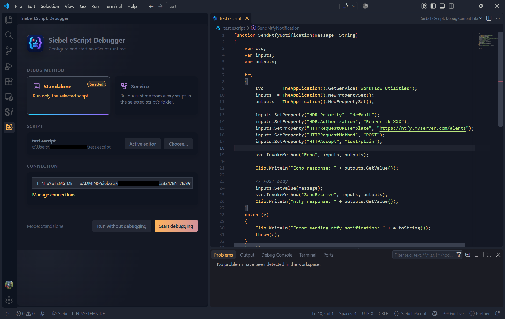
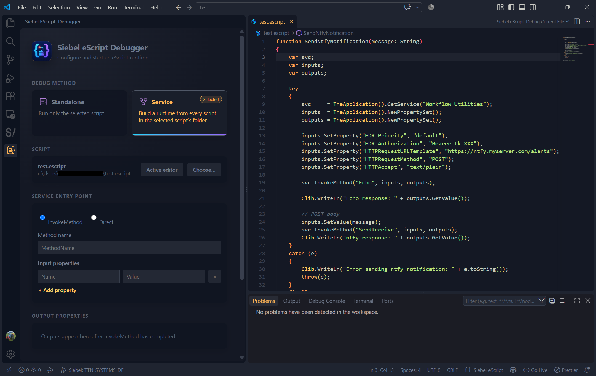
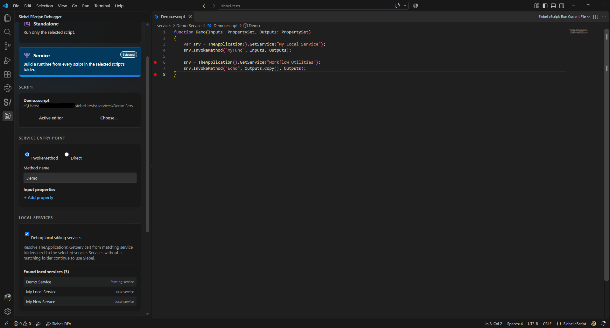
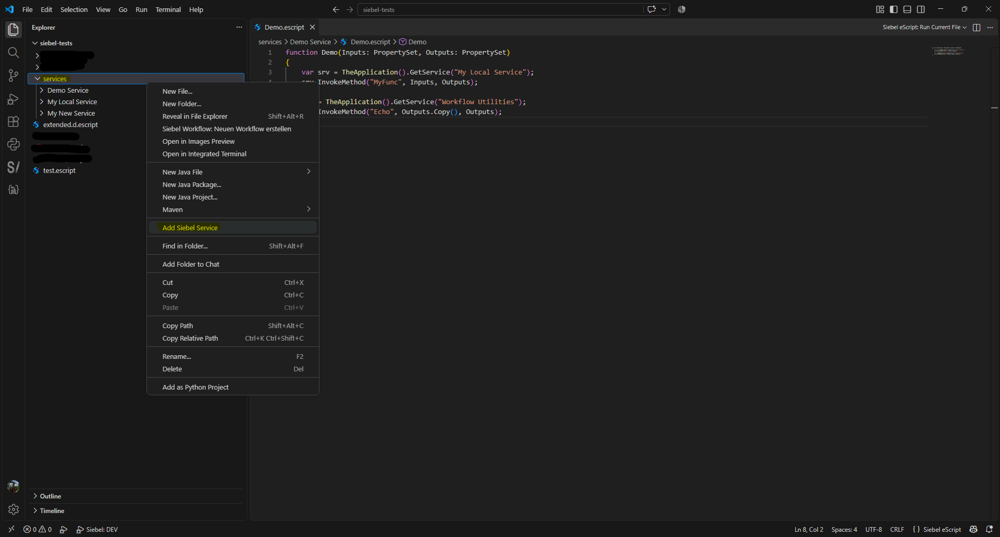
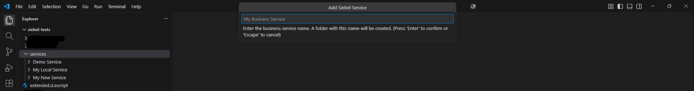
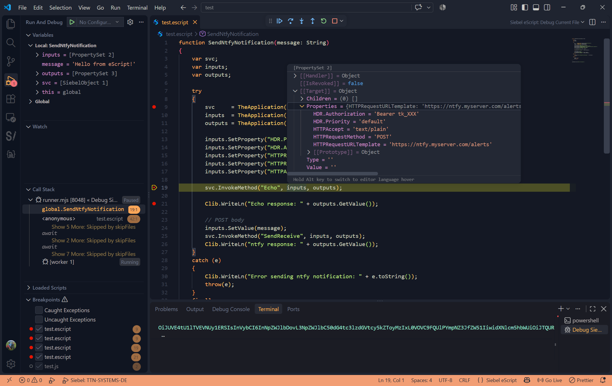

# Siebel eScript Debugger

> [!WARNING]
> **Experimental software:** This extension is at an experimental stage and is provided without warranties or guarantees regarding functionality, reliability, correctness, or fitness for a particular purpose. Using it in a production Siebel environment is explicitly discouraged. Use it only in secured development or test environments, with suitable test data, least-privilege accounts, and current backups. Scripts can read, modify, or delete data; review them carefully before execution. Use is entirely at your own risk. This extension is not an official Oracle product and is not supported by Oracle.

The Siebel eScript Debugger executes and debugs `.escript` files from Visual Studio Code against a Siebel Server. It exposes Oracle's Siebel Java Data Bean API synchronously.

For language support while editing Siebel scripts, use of the companion extension [Siebel eScript (ST)](https://marketplace.visualstudio.com/items?itemName=TitanSystems-DE.siebel-escript) is recommended.

## Getting started

1. Install Java 8 or newer and make `java` available, or configure `escriptDebugger.javaPath`.
2. Place the Oracle-provided `Siebel.jar` and its companion JARs in a central directory. This includes `SiebelJI_enu.jar` for English or the corresponding `SiebelJI_<language>.jar`. Configure the absolute path to `Siebel.jar` in `escriptDebugger.siebelJar`. Oracle JARs are not included with the extension.
   Version 0.2.0 compares this file with the SHA-256 of the JAR build verified for the debugger. A difference produces a non-blocking warning because compatibility and correct operation cannot be guaranteed.
3. Open an `.escript` file in VS Code.
4. Run **Siebel eScript: Manage Connections** and create a connection profile.
5. Open the launcher through the Siebel eScript icon in the Activity Bar, the editor debug icon, or **Siebel eScript: Open Debugger**.
6. Select the script, connection, and execution mode.
7. Choose **Start debugging** or **Run without debugging**.

`F5` starts the currently open `.escript` file directly in Standalone mode.

## Managing connections

The connection manager lets you:

- create a Siebel connection
- edit an existing connection
- select the active connection
- set the workspace for the active connection
- test a connection
- remove a connection

A profile contains a name, Siebel connection string, user name, language, and an optional Siebel Repository Workspace. The password is stored in VS Code SecretStorage, never in settings or script files.

The active connection and its configured workspace appear in the VS Code status bar, for example `Siebel: DEV (dev_sadmin_demo)`. Click the status bar item to manage the connection or use **Set workspace for active connection**. The debugger's connection list uses the same compact `connection (workspace)` notation and deliberately omits the user name and connection string.

### Siebel workspace context

In this documentation, *workspace* in connection-related text means a **Siebel Repository Workspace**, not the folder or `.code-workspace` file opened in VS Code. The workspace belongs to a connection profile because names and availability can differ between Siebel environments. For example, `DEV` can use `dev_sadmin_demo`, while `TEST` uses a different workspace.

The configured workspace is the execution context for both Standalone and Service mode. Every launch follows this order:

1. The launcher-selected connection is used, or the active connection when no explicit profile was selected.
2. The workspace stored in that connection profile is resolved.
3. The extension logs in to Siebel and looks up the workspace by its exact `Name` in `Repository Workspace`.
4. The runtime invokes `OpenWS` and then `PreviewWS`.
5. Only after both operations succeed does the requested script or service entry point run.

This prevents code from accidentally running outside the intended repository context. Workspace activation happens again for every launch; do not assume that a previous Siebel session is still in the correct workspace.

If a profile has no stored workspace, its debugger entry shows `connection (workspace required)`. Starting it opens an input box. That value applies to the current launch only; use **Set workspace for active connection** to persist it in the profile. Cancelling the input or entering an empty value stops the launch. A missing workspace, an inaccessible workspace, or a failure during `OpenWS`/`PreviewWS` also stops execution before user code is loaded.

Selecting a connection in the launcher makes it active when the launch begins. The status bar then reflects that profile and workspace. The **Test connection** action verifies login and server communication only; it does not open or validate the configured workspace.

## Launcher

The launcher provides two execution modes:

- **Standalone** runs exactly one script.
- **Service** loads all related scripts in one directory into a shared runtime.

The script can be taken from the active editor or selected in a file dialog. Both modes can run with the debugger or without breakpoints.

Changing the script through **Active editor** or **Choose…** preserves the selected Standalone or Service mode.

The compact launcher is permanently available in the VS Code sidebar. **Siebel eScript: Open Debugger** opens the same interface as a larger editor panel.

### Standalone interface



Standalone mode shows the active file and selected connection profile as `connection (workspace)`. The script can be started with or without the debugger.

### Service interface



Service mode adds entry-point selection, input properties, and the **Debug local sibling services** option. When that option is checked, the **Found local services** list appears immediately. After an `InvokeMethod` call, values read from `SERV_OUTPUTS` appear under **Output properties**.

## Standalone mode

Standalone mode loads and executes only the selected `.escript` file. It is suitable for self-contained scripts, tests, and direct Siebel server calls.

Example:

```js
var oBO = TheApplication().GetBusObject("Contact");
var oBC = oBO.GetBusComp("Contact");

oBC.ActivateField("Last Name");
oBC.ClearToQuery();
oBC.SetSearchSpec("Last Name", "Miller*");
oBC.ExecuteQuery(ForwardOnly);

if (oBC.FirstRecord()) {
  Clib.WriteLn(oBC.GetFieldValue("Last Name"));
}

oBO.Release();
```

## Service mode

In Service mode, every `.escript` file in the selected script's directory is part of the same service. All files share global variables and functions.

The selected script's folder name is the starting business-service name. Enable **Debug local sibling services** to also interpret every sibling folder as a business service. When a script calls `TheApplication().GetService("Service Name")`, a matching sibling folder is built locally with the same loading rules and returned instead of the Siebel Java Data Bean service. Folder matching is case-insensitive. If no matching folder exists, `GetService` continues to resolve the service through Siebel.

When the option is checked, the debugger panel lists every discovered folder and labels the selected folder as **Starting service**. Other folders are labeled **Local service**. This is the set of names that can be resolved locally during the session; it does not mean that every listed service has already been loaded.



*The selected folder is the starting service. Matching sibling folders are available for local `GetService` calls.*

Local services are loaded on first use and cached for the rest of the debug session. Each service has its own globals and service hooks, while PropertySets can be passed normally between the calling and called services. Breakpoints work in the scripts of locally loaded services.

Example layout:

```text
services/
├── Order Service/       # selected script; starting service
│   └── Submit.escript
├── Pricing Service/     # resolved locally by GetService("Pricing Service")
│   └── Calculate.escript
└── Shared Service/
    └── Execute.escript
```

### Creating a service folder

Right-click a folder in the VS Code Explorer and select **Add Siebel Service**. Enter a valid business-service name and confirm. The extension creates a child folder with that name and copies the bundled starter scripts into it:



*The command is available when a folder is selected in the Explorer.*



*The new service is created as a child of the selected Explorer folder.*

- `(declerations).escript`
- `Service_PreCanInvokeMethod.escript`
- `Service_PreInvokeMethod.escript`
- `Service_InvokeMethod.escript`

The command rejects path separators, Windows-reserved names, invalid filename characters, trailing periods or spaces, and names that already exist in the selected folder.

Recommended workflow:

1. In the Explorer, right-click the parent folder that contains your business services.
2. Select **Add Siebel Service**.
3. Enter the service name exactly as scripts will pass it to `GetService` and confirm.
4. Edit the generated hook files to implement the service methods.
5. Select any `.escript` file in the starting service folder and open the debugger launcher.
6. Select **Service**, check **Debug local sibling services**, and confirm that the expected names appear under **Found local services**.
7. Start debugging with either the `InvokeMethod` or `Direct` entry point.

The command never overwrites an existing service folder. If creation or copying fails, an error is shown and existing files are left unchanged.

### Calling another local service

Use the normal Siebel API in the starting service or any locally loaded service:

```js
var service = TheApplication().GetService("Pricing Service");
var inputs = TheApplication().NewPropertySet();
var outputs = TheApplication().NewPropertySet();
service.InvokeMethod("Calculate", inputs, outputs);
```

Resolution works as follows:

1. If **Debug local sibling services** is disabled, `GetService` always uses Siebel.
2. If it is enabled and a sibling folder has the requested name, that folder is built locally on first use and then cached.
3. If no sibling folder matches, the request falls back to Siebel automatically.

Folder matching is case-insensitive, but using the same spelling in code and in the Explorer keeps projects easier to understand. Every local service has its own globals and hook implementations, so functions from two services do not overwrite one another.

### Building the service runtime

Before invoking the selected entry point, the extension performs these steps:

1. It loads the bundled general-purpose `service-implementation.escript`, which provides core service functions such as `InvokeMethod`, `SetProperty`, and `GetProperty`.
2. If `(declerations).escript` exists in the script directory, it is loaded next. It may contain shared service variables and declarations.
3. All remaining `.escript` files in that directory are loaded in alphabetical order. `(declerations).escript` is not executed again.
4. After every file has run in the shared context, the entry point configured in the GUI is invoked.

Breakpoints can be set in all participating files.

### Direct entry point

For **Direct**, a dropdown lists every `.escript` file in the service directory except `(declerations).escript`. After building the runtime, the extension invokes a global function whose name matches the selected filename without `.escript`. This mapping is case-sensitive: the filename must match the function name exactly.

Example:

- selected file: `CalculatePrice.escript`
- expected function: `CalculatePrice()`

```js
function CalculatePrice() {
  // Entry point
}
```

### InvokeMethod entry point

For **InvokeMethod**, configure:

- the method name to invoke
- any number of string input properties, each consisting of a name and value

The runtime provides two global PropertySets:

- `SERV_INPUTS` contains the input properties configured in the GUI.
- `SERV_OUTPUTS` receives the service results.

After building the runtime, the extension calls:

```js
InvokeMethod(methodName, SERV_INPUTS, SERV_OUTPUTS);
```

When the call completes, all properties in `SERV_OUTPUTS` are read and displayed by name and value in the launcher.

User method files must override the service hooks that decide whether and how a method is handled. `canInvoke` is a reference parameter and therefore must retain the `&` marker:

```js
function Service_PreCanInvokeMethod(methodName, &canInvoke) {
  canInvoke = methodName == "MyMethod";
  return CancelOperation;
}

function Service_PreInvokeMethod(methodName, inputs, outputs) {
  if (methodName != "MyMethod") return ContinueOperation;
  outputs.SetProperty("Result", inputs.GetProperty("Value"));
  return CancelOperation;
}
```

Returning `ContinueOperation` delegates processing to the next stage. Returning `CancelOperation` indicates that the hook handled the stage. An allowed method for which `Service_PreInvokeMethod` returns `ContinueOperation` must be implemented by another handler or the runtime reports it as unimplemented.

## Debugging

The extension supports the standard VS Code debugging features:

- breakpoints in `.escript` files
- step into, step over, and step out
- Variables view
- Call Stack
- live `Clib.WriteLn` and `Clib.puts` output in the Debug Console
- stopping and restarting execution

In Service mode, every loaded file runs under its original path, so breakpoints also work in helper functions and shared scripts.

The runner is launched with VS Code's internal debug console. No integrated terminal is opened and the generated process environment is therefore not printed as a PowerShell command. This applies to both debugging and **Run without debugging**.

### Inspecting PropertySets

PropertySets are expandable in the Variables view and in debugger hovers. Their type, value, child objects, and properties can therefore be inspected directly while execution is paused.



## Typed ST eScript

Typed variables, parameters, and return values can use the customary eScript syntax:

```js
var oBC : BusComp;

function FindContact(id : String) : BusComp {
  // ...
}
```

Original files remain unchanged. Type declarations are processed only in memory for execution. Breakpoints and stack traces continue to refer to the original `.escript` files.

## Reference parameters

Primitive values can be passed by reference using `&` parameters:

```js
function SetResult(input, &result) {
  result = input + " processed";
}

var value = "";
SetResult("data", value);
// value is now "data processed"
```

Inside the function, a reference parameter is used like an ordinary variable. Changes are written back to the caller when the function exits, including after an early `return` or exception.

Assignable expressions such as variables, object properties, and array elements may be passed as reference arguments. Fully dynamic calls whose function name is resolved from a string at runtime cannot be matched to an `&` signature.

## Legacy `with` statements

Legacy Siebel eScript `with (object)` statements are supported for ordinary objects and synchronous remote Siebel objects:

```js
with (oBC) {
  ClearToQuery();
  ExecuteQuery(ForwardOnly);
  FirstRecord();
}
```

Scripts run as classic, non-strict scripts because JavaScript strict mode does not permit `with` statements.

## Siebel objects and global functions

The familiar Siebel methods are exposed synchronously in PascalCase. Objects and methods backed by Oracle's Java Data Bean are available for:

- Application
- BusObject
- BusComp
- Service
- PropertySet

Additional global functions and objects include:

- `TheApplication()`
- `Application()`
- `ToNumber(value)`
- `ToString(value)`
- `Clib.WriteLn(value)`
- `Clib.puts(value)`
- `Clib.getenv(name)`
- `Clib.time()`

## Type definitions for development tools

The extension includes the ambient declaration file `siebel-escript.d.ts`. It describes the additional globals, constants, and synchronous Siebel objects supplied by the debugger runtime. TypeScript-based tools can therefore resolve expressions such as:

```js
Clib.WriteLn("Starting");

var oBO = TheApplication().GetBusObject("Contact");
var oBC = oBO.GetBusComp("Contact");
oBC.ExecuteQuery(ForwardOnly);
oBO.Release();
```

### Installing declarations in a project

1. Open the project directory as a VS Code workspace.
2. Run **Siebel eScript: Install Type Definitions** from the Command Palette.
3. The extension copies the declarations to `.vscode/typings/siebel-escript.d.ts`.
4. Include this file in the configuration of your TypeScript, ESLint, or analysis tool.

A TypeScript-compatible checking project can include it as follows:

```json
{
  "compilerOptions": {
    "allowJs": true,
    "checkJs": true,
    "noEmit": true
  },
  "include": [
    ".vscode/typings/**/*.d.ts",
    "scripts/**/*"
  ]
}
```

Tools that ignore unknown file extensions must also be configured for `.escript`. With ESLint and a TypeScript-based parser, this is typically done with `extraFileExtensions: [".escript"]`. VS Code's built-in TypeScript language support does not automatically analyze the custom `escript` language mode, so the declaration file is primarily intended for suitably configured linters, type checkers, and other analysis tools.

### Adding project-specific types

The interfaces are intentionally incremental. A project can add methods in its own `.d.ts` file without modifying the bundled declaration:

```ts
interface BusComp {
  RefreshRecord(): string;
}

interface Application {
  GetCustomContext(): string;
}
```

TypeScript combines identically named interfaces through declaration merging. A newer extension can replace its base definitions while project-specific additions remain in a separate file.

## Constants

The following Siebel constants are globally available:

- events: `ContinueOperation`, `CancelOperation`
- cursors: `ForwardBackward`, `ForwardOnly`
- new records: `NewBefore`, `NewAfter`, `NewBeforeCopy`, `NewAfterCopy`
- visibility: `SalesRepView`, `ManagerView`, `PersonalView`, `AllView`, `NoneSetView`, `OrganizationView`, `ContactView`, `GroupView`, `CatalogView`, `SubOrganizationView`
- compatibility aliases: `NoneView`, `NoneSetViewMode`, `OperationComplete`

## Optional launch.json

Standalone debugging can alternatively be launched through `.vscode/launch.json`:

```json
{
  "version": "0.2.0",
  "configurations": [{
    "type": "escript",
    "request": "launch",
    "name": "Debug Siebel eScript",
    "program": "${file}",
    "connection": "Development"
  }]
}
```

If `connection` is omitted, the extension uses the active connection profile. The workspace is not configured separately in `launch.json`; it is resolved from the selected connection profile as described above.

## Limitations and notes

- Browser- and Siebel Client-specific APIs not provided by Oracle's Java Data Bean are unavailable.
- Business Object, Business Component, Service, and field names must match the target Siebel repository.
- `ViewMode` constants do not alter server-side permissions.
- Test scripts that write data in a suitable test environment first.
- Compatibility depends on the configured Oracle `Siebel.jar` and target Siebel version.

## License and trademarks

The [TitanSystems Free-to-Use No-Derivatives License](LICENSE) permits the unmodified official extension to be used free of charge, including for professional work in commercial environments. Modification is permitted only to prepare contributions to the official project. Commercial distribution, unofficial modified versions, and integration into other products require prior written permission. Third-party components remain governed by their own licenses.

Oracle, Siebel, and related product names are trademarks of their respective owners. This extension is an independent project and is not endorsed or supported by Oracle.
