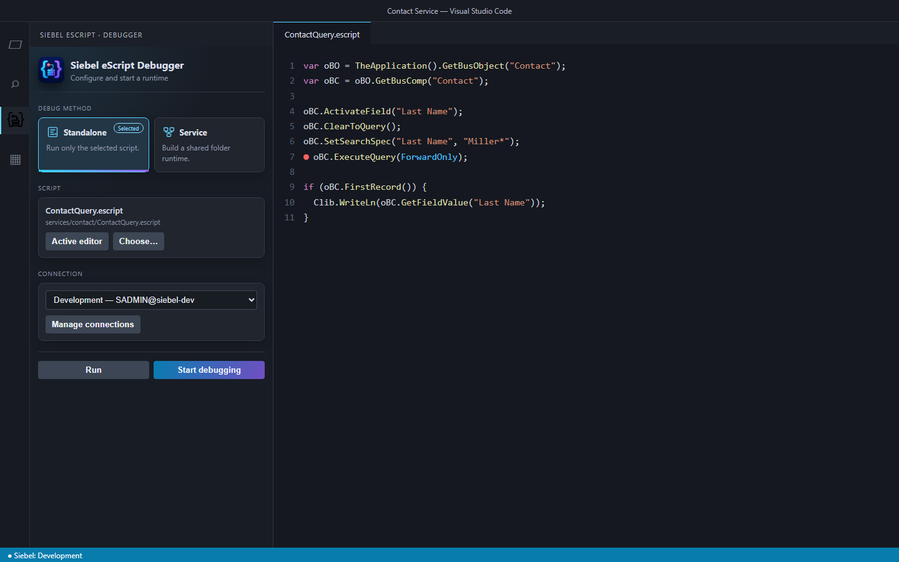
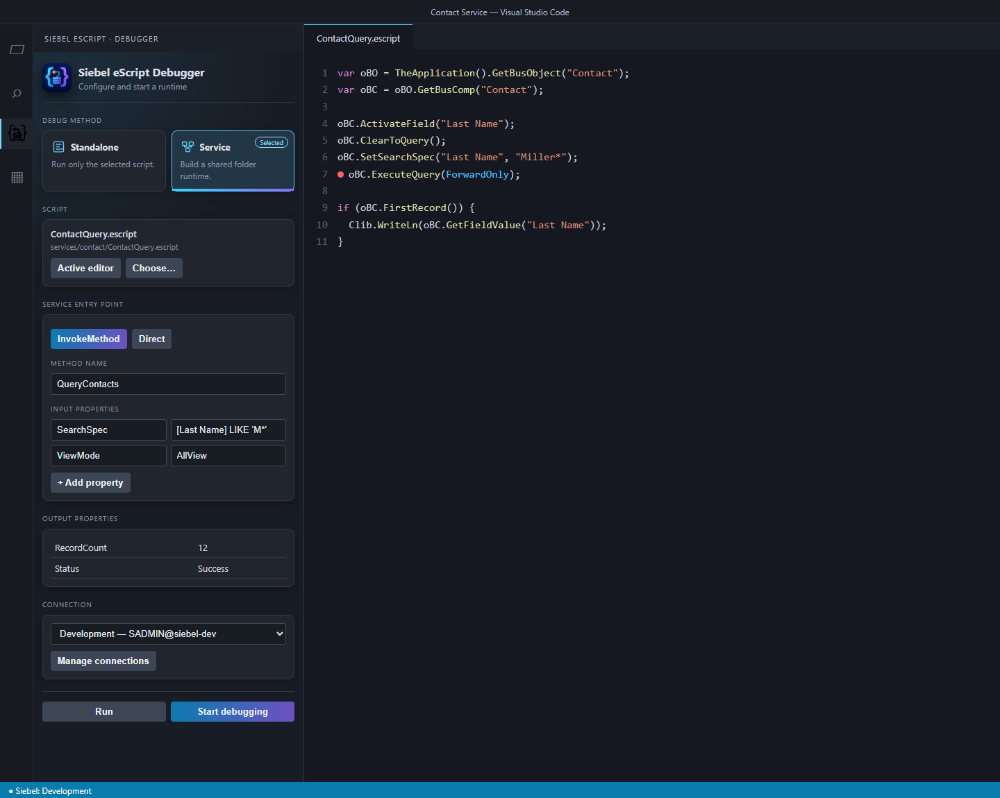

[🇬🇧 English](README.md) | 🇩🇪 **Deutsch**

# Siebel eScript Debugger

> [!WARNING]
> **Experimentelle Software:** Diese Extension befindet sich in einem experimentellen Entwicklungsstadium und wird ohne Gewährleistung oder Zusicherung einer bestimmten Funktionalität, Fehlerfreiheit oder Eignung bereitgestellt. Der Einsatz in produktiven Siebel-Umgebungen wird ausdrücklich nicht empfohlen. Verwende sie ausschließlich in abgesicherten Entwicklungs- oder Testumgebungen, mit geeigneten Testdaten, minimal erforderlichen Berechtigungen und aktuellen Sicherungen. Skripte können Daten lesen, verändern oder löschen; prüfe sie daher vor der Ausführung sorgfältig. Die Nutzung erfolgt auf eigene Verantwortung. Diese Extension ist kein offizielles Produkt von Oracle und wird nicht von Oracle unterstützt.

Mit dem Siebel eScript Debugger können `.escript`-Dateien in Visual Studio Code gegen einen Siebel Server ausgeführt und debuggt werden. Die Extension stellt eine synchrone Siebel-eScript-Oberfläche über SISNAPI bereit.

## Erste Schritte

1. Öffne eine `.escript`-Datei in VS Code.
2. Rufe **Siebel eScript: Manage Connections** auf und lege ein Verbindungsprofil an.
3. Öffne die Startzentrale über das Siebel-eScript-Icon in der linken Activity Bar, über das Debug-Symbol im Editor oder über **Siebel eScript: Open Debugger**.
4. Wähle das Skript, die Verbindung und den gewünschten Modus.
5. Starte die Ausführung mit **Start debugging** oder **Run without debugging**.

`F5` startet die aktuell geöffnete `.escript`-Datei direkt im Standalone-Modus.

## Verbindungen verwalten

Die Verbindungsverwaltung bietet folgende Aktionen:

- neue Siebel-Verbindung anlegen
- vorhandene Verbindung bearbeiten
- aktive Verbindung auswählen
- Verbindung testen
- Verbindung entfernen

Ein Profil enthält Name, SISNAPI-URL, Benutzername und Sprache. Das Kennwort wird im SecretStorage von VS Code gespeichert und nicht in den Einstellungen oder Skriptdateien abgelegt.

Die aktive Verbindung wird in der VS-Code-Statusleiste angezeigt. In der Startzentrale kann für jede Ausführung ein anderes Profil ausgewählt werden.

## Startzentrale

Die Startzentrale bietet zwei Ausführungsmodi:

- **Standalone** führt genau ein Skript aus.
- **Service** lädt alle zusammengehörigen Skripte eines Ordners in eine gemeinsame Runtime.

Das Skript kann aus dem aktiven Editor übernommen oder über einen Dateidialog gewählt werden. Beide Modi können mit Debugger oder ohne Haltepunkte ausgeführt werden.

Beim Wechsel des Skripts über **Active editor** oder **Choose…** bleibt der ausgewählte Standalone- oder Service-Modus erhalten.

Die kompakte Ansicht steht dauerhaft in der VS-Code-Seitenleiste zur Verfügung. **Siebel eScript: Open Debugger** öffnet dieselbe Oberfläche bei Bedarf als größere Editor-Panelansicht.

### Oberfläche im Standalone-Modus



Im Standalone-Modus werden die aktive Datei und das gewählte Verbindungsprofil direkt in der Startzentrale angezeigt. Von dort lässt sich das Skript mit oder ohne Debugger starten.

### Oberfläche im Service-Modus



Im Service-Modus ergänzt die Startzentrale die Auswahl des Einstiegspunkts sowie die Eingabe von Input-Properties. Nach einem `InvokeMethod`-Aufruf erscheinen die aus `SERV_OUTPUTS` gelesenen Werte im Bereich **Output properties**.

## Standalone-Modus

Im Standalone-Modus wird ausschließlich die ausgewählte `.escript`-Datei geladen und ausgeführt. Dieser Modus eignet sich für eigenständige Skripte, Tests und direkte SISNAPI-Aufrufe.

Beispiel:

```js
var oBO = TheApplication().GetBusObject("Contact");
var oBC = oBO.GetBusComp("Contact");

oBC.ActivateField("Last Name");
oBC.ClearToQuery();
oBC.SetSearchSpec("Last Name", "Miller*");
oBC.ExecuteQuery(ForwardOnly);

if (oBC.FirstRecord()) {
  Clib.WriteLn(oBC.GetFieldValue("Last Name"));
}

oBO.Release();
```

## Service-Modus

Im Service-Modus gelten alle `.escript`-Dateien im Ordner des ausgewählten Skripts als Bestandteil desselben Services. Sie teilen sich globale Variablen und Funktionen.

### Aufbau der Service-Runtime

Vor dem Aufruf des gewählten Startpunkts führt die Extension folgende Schritte aus:

1. Die allgemeine, mit der Extension gelieferte `service-implementation.escript` wird geladen. Sie stellt die grundlegenden Service-Funktionen wie `InvokeMethod`, `SetProperty` und `GetProperty` bereit.
2. Falls im Skriptordner eine Datei namens `(declerations).escript` vorhanden ist, wird sie als Nächstes geladen. Sie kann gemeinsame Variablen und Deklarationen des Services enthalten.
3. Alle übrigen `.escript`-Dateien des Ordners werden in alphabetischer Reihenfolge geladen. `(declerations).escript` wird dabei nicht erneut ausgeführt.
4. Nachdem alle Dateien im gemeinsamen Kontext ausgeführt wurden, wird der in der GUI konfigurierte Startpunkt aufgerufen.

Breakpoints können in allen beteiligten Dateien gesetzt werden.

### Startpunkt „Direct“

Bei **Direct** zeigt ein Dropdown alle `.escript`-Dateien des Service-Ordners außer `(declerations).escript` an. Nach dem Aufbau der Runtime ruft die Extension eine globale Funktion auf, deren Name dem Dateinamen ohne `.escript` entspricht. Diese Zuordnung unterscheidet Groß- und Kleinschreibung: Der Dateiname muss exakt dem Funktionsnamen entsprechen.

Beispiel:

- gewählte Datei: `CalculatePrice.escript`
- erwartete Funktion: `CalculatePrice()`

```js
function CalculatePrice() {
  // Einstiegspunkt
}
```

### Startpunkt „InvokeMethod“

Bei **InvokeMethod** werden in der GUI konfiguriert:

- der aufzurufende Methodenname
- beliebig viele Input-Properties aus Name und String-Wert

Für den Aufruf stellt die Runtime zwei globale PropertySets bereit:

- `SERV_INPUTS` enthält die in der GUI erfassten Input-Properties.
- `SERV_OUTPUTS` nimmt die Ergebnisse des Services auf.

Nach dem Aufbau der Runtime erfolgt der Aufruf:

```js
InvokeMethod(methodName, SERV_INPUTS, SERV_OUTPUTS);
```

Nach Abschluss liest die Extension alle Properties aus `SERV_OUTPUTS` und zeigt Name und Wert in der Startzentrale an.

Die Methoden-Dateien des Benutzers müssen die Service-Hooks überschreiben, die entscheiden, ob und wie eine Methode verarbeitet wird. `canInvoke` ist ein Referenzparameter und muss deshalb das `&` beibehalten:

```js
function Service_PreCanInvokeMethod(methodName, &canInvoke) {
  canInvoke = methodName == "MyMethod";
  return CancelOperation;
}

function Service_PreInvokeMethod(methodName, inputs, outputs) {
  if (methodName != "MyMethod") return ContinueOperation;
  outputs.SetProperty("Result", inputs.GetProperty("Value"));
  return CancelOperation;
}
```

`ContinueOperation` übergibt die Verarbeitung an die nächste Stufe. `CancelOperation` signalisiert, dass der Hook die Stufe behandelt hat. Gibt `Service_PreInvokeMethod` für eine erlaubte Methode `ContinueOperation` zurück, muss ein anderer Handler sie implementieren; andernfalls meldet die Runtime die Methode als nicht implementiert.

## Debugging

Die Extension unterstützt die üblichen Funktionen des VS-Code-Debuggers:

- Breakpoints in `.escript`-Dateien
- Einzelschritt, Prozedurschritt und Rücksprung
- Variablenansicht
- Call Stack
- Live-Ausgabe von `Clib.WriteLn` und `Clib.puts` im integrierten Terminal
- Stoppen und Neustarten der Ausführung

Im Service-Modus werden alle geladenen Dateien unter ihrem ursprünglichen Dateipfad ausgeführt. Breakpoints können daher auch in Hilfsfunktionen oder gemeinsam verwendeten Skripten gesetzt werden.

## Typisiertes ST eScript

Typisierte Variablen, Parameter und Rückgabewerte können in der gewohnten eScript-Schreibweise verwendet werden:

```js
var oBC : BusComp;

function FindContact(id : String) : BusComp {
  // ...
}
```

Die Originaldateien bleiben unverändert. Typdeklarationen werden nur für die Ausführung intern verarbeitet. Breakpoints und Stacktrace-Verweise zeigen weiterhin auf die ursprünglichen `.escript`-Dateien.

## Referenzparameter

Primitive Werte können mit `&` als Referenzparameter übergeben werden:

```js
function SetResult(input, &result) {
  result = input + " processed";
}

var value = "";
SetResult("data", value);
// value enthält jetzt "data processed"
```

Innerhalb der Funktion wird der Referenzparameter wie eine normale Variable verwendet. Änderungen werden beim Verlassen der Funktion an den Aufrufer zurückgeschrieben, auch bei einem frühen `return` oder einer Exception.

Als Referenzargumente können zuweisbare Ausdrücke wie Variablen, Objekteigenschaften und Arrayelemente verwendet werden. Vollständig dynamische Funktionsaufrufe, deren Funktionsname erst zur Laufzeit aus einem String ermittelt wird, können keiner `&`-Signatur zugeordnet werden.

## Ältere `with`-Anweisungen

Ältere Siebel-eScript-Anweisungen der Form `with (object)` werden sowohl für gewöhnliche Objekte als auch für synchrone Remote-Siebel-Objekte unterstützt:

```js
with (oBC) {
  ClearToQuery();
  ExecuteQuery(ForwardOnly);
  FirstRecord();
}
```

Die Skripte werden als klassische, nicht-strikte Skripte ausgeführt, da der strikte JavaScript-Modus keine `with`-Anweisungen erlaubt.

## Siebel-Objekte und globale Funktionen

Die bekannten Siebel-Methoden werden synchron und in PascalCase angeboten. Verfügbar sind die vom SISNAPI-Framework bereitgestellten Objekte und Methoden für:

- Application
- BusObject
- BusComp
- Service
- PropertySet

Zusätzliche globale Funktionen und Objekte:

- `TheApplication()`
- `Application()`
- `ToNumber(value)`
- `ToString(value)`
- `Clib.WriteLn(value)`
- `Clib.puts(value)`
- `Clib.getenv(name)`
- `Clib.time()`

## Typdefinitionen für Entwicklungswerkzeuge

Die Extension enthält die ambient Deklarationsdatei `siebel-escript.d.ts`. Sie beschreibt die zusätzlichen globalen Funktionen, Konstanten und synchronen Siebel-Objekte der Debugger-Runtime. Dadurch können TypeScript-basierte Prüfwerkzeuge beispielsweise folgende Ausdrücke korrekt auflösen:

```js
Clib.WriteLn("Starting");

var oBO = TheApplication().GetBusObject("Contact");
var oBC = oBO.GetBusComp("Contact");
oBC.ExecuteQuery(ForwardOnly);
oBO.Release();
```

### Deklarationen im Projekt installieren

1. Öffne den Projektordner als VS-Code-Workspace.
2. Rufe **Siebel eScript: Install Type Definitions** über die Befehlspalette auf.
3. Die Extension kopiert die Deklarationen nach `.vscode/typings/siebel-escript.d.ts`.
4. Nimm diese Datei in die Konfiguration des verwendeten TypeScript-, ESLint- oder Analysewerkzeugs auf.

Ein TypeScript-kompatibles Prüfprojekt kann die Deklaration beispielsweise so einbeziehen:

```json
{
  "compilerOptions": {
    "allowJs": true,
    "checkJs": true,
    "noEmit": true
  },
  "include": [
    ".vscode/typings/**/*.d.ts",
    "scripts/**/*"
  ]
}
```

Werkzeuge, die unbekannte Dateiendungen standardmäßig ignorieren, müssen zusätzlich für `.escript` konfiguriert werden. Bei ESLint mit einem TypeScript-basierten Parser erfolgt dies typischerweise über dessen Option `extraFileExtensions: [".escript"]`. Die eingebaute VS-Code-TypeScript-Sprachunterstützung analysiert den eigenen Sprachmodus `escript` nicht automatisch; die Deklarationsdatei richtet sich daher insbesondere an entsprechend konfigurierte Linter, Type-Checker und andere Analysewerkzeuge.

### Projektspezifische Typen ergänzen

Die Interfaces sind absichtlich inkrementell definiert. Ein Projekt kann zusätzliche Methoden in einer eigenen `.d.ts`-Datei ergänzen, ohne die mitgelieferte Datei zu verändern:

```ts
interface BusComp {
  RefreshRecord(): string;
}

interface Application {
  GetCustomContext(): string;
}
```

TypeScript führt gleichnamige Interfaces per Declaration Merging zusammen. Eine aktualisierte Version der Extension kann deshalb die Basisdefinition ersetzen, während projektspezifische Erweiterungen in einer getrennten Datei erhalten bleiben.

## Konstanten

Folgende Siebel-Konstanten stehen global zur Verfügung:

- Events: `ContinueOperation`, `CancelOperation`
- Cursor: `ForwardBackward`, `ForwardOnly`
- neue Datensätze: `NewBefore`, `NewAfter`, `NewBeforeCopy`, `NewAfterCopy`
- Sichtbarkeit: `SalesRepView`, `ManagerView`, `PersonalView`, `AllView`, `NoneSetView`, `OrganizationView`, `ContactView`, `GroupView`, `CatalogView`, `SubOrganizationView`
- Kompatibilitätsaliase: `NoneView`, `NoneSetViewMode`, `OperationComplete`

## Optionale launch.json

Standalone-Debugging kann alternativ über `.vscode/launch.json` gestartet werden:

```json
{
  "version": "0.2.0",
  "configurations": [{
    "type": "escript",
    "request": "launch",
    "name": "Debug Siebel eScript",
    "program": "${file}",
    "connection": "Development"
  }]
}
```

Ohne `connection` verwendet die Extension das aktive Verbindungsprofil.

## Grenzen und Hinweise

- Browser- und Siebel-Client-spezifische APIs, die nicht vom SISNAPI-Framework bereitgestellt werden, stehen nicht zur Verfügung.
- Namen von Business Objects, Business Components, Services und Feldern müssen zum jeweiligen Siebel Repository passen.
- `ViewMode`-Konstanten ändern keine serverseitigen Berechtigungen.
- Schreibende Skripte sollten zunächst in einer geeigneten Testumgebung geprüft werden.
- Der verwendete SISNAPI-Client ist experimentell und sollte gegen die eingesetzte Siebel-Version validiert werden.

## Lizenz und Marken

Diese Extension wird unter der [MIT-Lizenz](LICENSE) veröffentlicht. Oracle, Siebel und zugehörige Produktnamen sind Marken ihrer jeweiligen Inhaber. Diese Extension ist ein unabhängiges Projekt und wird von Oracle weder unterstützt noch empfohlen.
